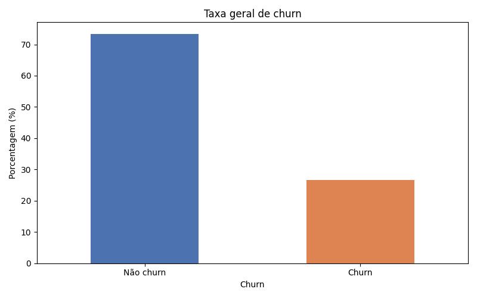
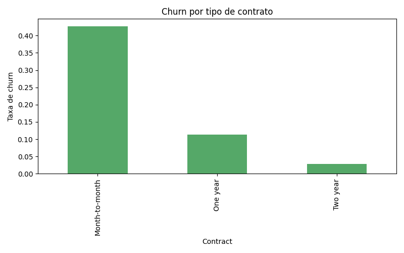
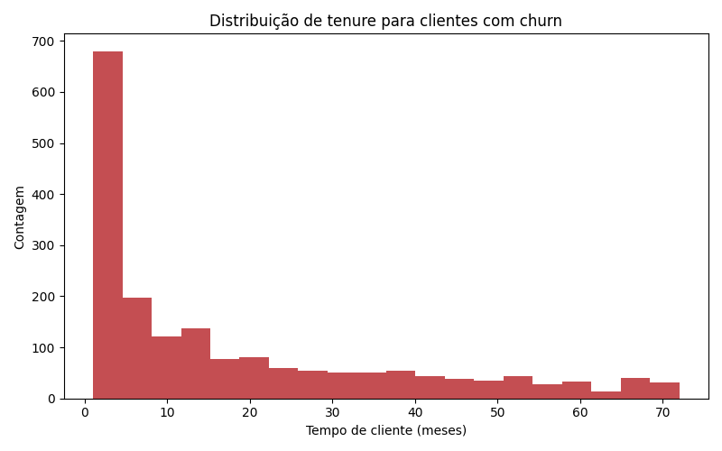
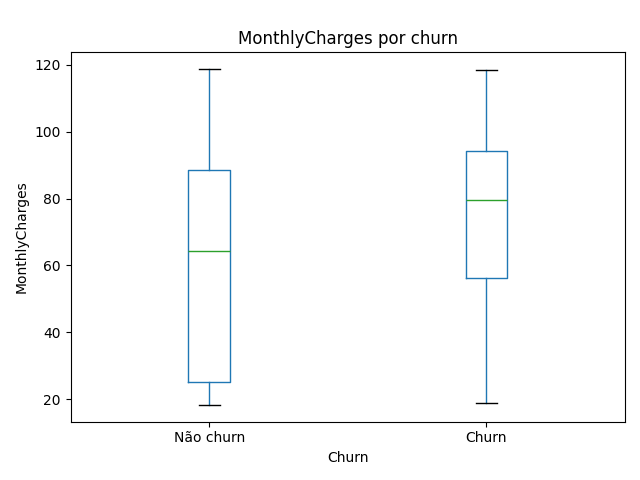

# 📉 Customer Churn Analysis & Prediction — Telco


> Identifying which telecom customers are most likely to cancel — and quantifying the monthly revenue a proactive retention strategy could protect.

---

## 🎯 Business Problem

Customer churn is one of the most expensive problems in the telecom industry. Acquiring a new customer costs **5–7× more** than retaining an existing one, which means every cancellation that could have been prevented represents compounded lost value — not just lost revenue, but lost acquisition investment too.

This project works with a dataset of **7,043 telecom customers** and sets out to answer two business-critical questions:

1. **Who is churning — and why?** What behavioral, contractual, and financial patterns separate customers who leave from those who stay?
2. **Who will churn next?** Can a predictive model flag at-risk customers early enough for the retention team to intervene?

The result is both a clear narrative of churn drivers and a deployable model that identifies at-risk accounts before they cancel.

---

## 🔍 Approach & Methodology

### 1. Exploratory Data Analysis
The dataset was profiled for missing values, data-type inconsistencies, and class distribution. `TotalCharges` required coercion from string to numeric; records with null values were removed with negligible data loss (<0.2%). Churn breakdown, tenure patterns, and the distributions of key financial variables were visualized to form initial hypotheses.

### 2. Feature Engineering & Preprocessing
Categorical variables — contract type, payment method, internet service, and others — were one-hot encoded. Numerical features (tenure, monthly charges, total charges) were standardized using `StandardScaler` so the model treats all inputs on a comparable scale regardless of unit.

### 3. Model Selection — Why Logistic Regression?

Logistic Regression was deliberately chosen over more complex alternatives for three reasons:

- **Interpretability.** Coefficients translate directly into business language: stakeholders can see exactly which factors — contract type, tenure, monthly charges — drive churn probability up or down. This is critical when findings need to influence product and pricing decisions.
- **Fit for binary classification.** Churn is a yes/no outcome. Logistic regression is purpose-built for estimating class probabilities in this setting, producing calibrated scores rather than arbitrary decision boundaries.
- **Transparent baseline.** Before reaching for ensemble methods or neural networks, a well-tuned logistic model establishes a performance floor. Any added complexity must justify itself against this auditable starting point.

### 4. Evaluation
The model was evaluated on a stratified held-out test set. The primary concern was **recall for churners**: missing a customer who was about to cancel (false negative) is more costly than sending an unnecessary retention offer (false positive). The confusion matrix and classification report were used alongside overall accuracy to measure this trade-off.

---

## 📊 Key Findings

### 1 · Contract Type Is the Strongest Churn Signal

| Contract Type  | Churn Rate |
|----------------|-----------|
| Month-to-month | **42%**   |
| One year       | 11%       |
| Two year       | **3%**    |

Month-to-month customers churn at **14× the rate** of two-year contract holders. The implication is direct: every customer successfully migrated from a monthly to an annual or biennial contract is a significant reduction in churn risk. Targeted upgrade incentives at onboarding or at the 3-month mark could materially move this number.

### 2 · Churn Is Front-Loaded — the First 10 Months Are Critical

**67% of all cancellations happen within the first 10 months** of the customer relationship. Churn risk drops sharply after the one-year mark. This pattern indicates that customers who don't experience clear value early on don't stay to find it later. A structured onboarding program — proactive check-ins, guided setup, early usage milestones — directly addresses the highest-risk window.

### 3 · Churners Pay More Per Month Than Retained Customers

| Segment               | Median Monthly Charge |
|-----------------------|-----------------------|
| Customers who churned | **$79**               |
| Customers who stayed  | $64                   |

Customers who leave pay a **23% higher** median monthly bill. Rather than signaling higher value to the business, this gap suggests a perceived price-to-value mismatch — they're paying premium rates without feeling sufficiently locked in by long-term contracts or service satisfaction.

---

## 💰 Business Impact

| Metric                                          | Value        |
|-------------------------------------------------|--------------|
| Overall churn rate                              | 26.5%        |
| Model accuracy (held-out test set)              | **79.8%**    |
| At-risk customers correctly identified (TP)     | **211**      |
| Median monthly charge — churners                | $79          |
| **Monthly recurring revenue at risk, identified** | **$16,669** |

The model correctly identified **211 customers** who were genuinely at risk of churning — each paying a median of **$79/month**. That is **$16,669 in monthly recurring revenue** that a targeted retention campaign now has a chance to protect.

At a conservative **30% save rate** on flagged accounts, that translates to approximately **$5,000 preserved per month**, or roughly **$60,000 per year** — from a single model run. As the model is retrained on fresher data and integrated into automated outreach workflows, the compounding retention ROI scales further.

Beyond the dollar figure, identifying *which* customers are at risk allows the retention team to move from reactive, expensive win-back campaigns to proactive, low-cost interventions — a structural shift in how the business manages customer lifetime value.

---

## 🛠️ Tech Stack

| Library          | Version | Purpose                                        |
|------------------|---------|------------------------------------------------|
| **Python**       | 3.10+   | Core language                                  |
| **Pandas**       | 2.2.3   | Data loading, cleaning, feature engineering    |
| **NumPy**        | 1.26.4  | Numerical operations                           |
| **Scikit-learn** | 1.3.2   | Preprocessing, model training, evaluation      |
| **Matplotlib**   | 3.8.2   | Custom visualizations                          |
| **Seaborn**      | 0.12.3  | Statistical plots and distribution charts      |
| **Jupyter**      | 7.0.5   | Interactive analysis and narrative reporting   |

---

## 🚀 How to Run

### 1. Clone the repository
```bash
git clone https://github.com/your-username/churn-analysis.git
cd churn-analysis
```

### 2. Install dependencies
```bash
pip install -r requirements.txt
```

### 3. Launch the notebook
```bash
jupyter notebook notebooks/analysis.ipynb
```

The notebook is fully self-contained: it loads the raw data from `data/`, performs all cleaning and feature engineering, trains the model, and generates every visualization — in sequence, no additional configuration needed.

To run the analysis as a script instead:
```bash
python src/churn_analysis.py
```

---

## 📁 Project Structure

```
churn-analysis/
│
├── data/
│   └── WA_Fn-UseC_-Telco-Customer-Churn.csv   # Source dataset — 7,043 customers
│
├── notebooks/
│   └── analysis.ipynb                          # End-to-end analysis notebook
│
├── src/
│   └── churn_analysis.py                       # Standalone analysis script
│
├── images/
│   ├── churn_rate.png                          # Overall churn rate breakdown
│   ├── churn_by_contract.png                   # Churn rate by contract type
│   ├── churn_by_tenure.png                     # Churn distribution over tenure
│   └── monthly_charges_boxplot.png             # Monthly charges: churners vs. retained
│
├── requirements.txt
└── README.md
```

---

## 📈 Visualizations

### Overall Churn Rate


26.5% of the 7,043 customers in the dataset churned — high enough to make predictive retention a clear business priority rather than a nice-to-have.

### Churn Rate by Contract Type


The gap between month-to-month (42%) and two-year contracts (3%) is the starkest single finding in the dataset. Contract migration is the most direct retention lever available to the business.

### Churn Distribution by Tenure


Churn is heavily concentrated in the first 10 months of the customer lifecycle. The survival curve flattens sharply after month 12, confirming that early engagement is where retention investment has the highest expected return.

### Monthly Charges — Churners vs. Retained Customers


Churning customers carry a higher median monthly bill ($79 vs. $64). Combined with the contract-type finding, this points to a population paying premium prices without the commitment or perceived value that keeps customers long-term.

---

## 📬 Contact

Questions, feedback, or collaboration? Open an issue or connect on [LinkedIn](https://linkedin.com/in/your-profile).
